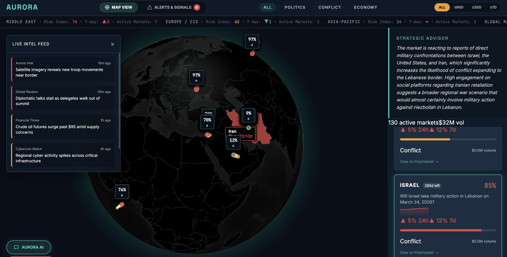

# Aurora — Technical Documentation

## Table of Contents

1. [Project Overview](#1-project-overview)
2. [Architecture](#2-architecture)
3. [Data Pipeline](#3-data-pipeline)
4. [File Reference](#4-file-reference)
5. [API Reference](#5-api-reference)
6. [Context Module](#6-context-module)
7. [Configuration & Environment](#7-configuration--environment)
8. [Running the Project](#8-running-the-project)
9. [Docker Deployment](#9-docker-deployment)
10. [Data Formats](#10-data-formats)
11. [External APIs](#11-external-apis)

---

## 1. Project Overview

Aurora is a geopolitical prediction market intelligence platform. It monitors active war and conflict markets on [Polymarket](https://polymarket.com), enriches them with live trading signals, fetches relevant news from GDELT and Reddit, and uses Google Gemini to generate a natural-language analysis of what is driving each market.

The output is a structured JSON file (`markets.json`) grouped by country, where each market includes:
- Live probability and trading volume
- Odds velocity (rate of change over 24h)
- Recent news headlines and Reddit posts
- An LLM-generated analysis with sentiment and confidence score

This data is served via a FastAPI backend and visualised on an interactive Next.js dashboard featuring a 3D globe, market sidebar with Gemini analysis, and regional risk indices.

---

## 2. Architecture

```
┌─────────────────────────────────────────────────────────┐
│                      populate.py                        │
│            (runs automatically on server startup)       │
│                                                         │
│  Step 1: Fetch events by tag (Polymarket Gamma API)     │
│  Step 2: Flatten markets from events                    │
│  Step 3: Filter by 24h volume > $1,000                  │
│  Step 4: Fetch price history, compute velocity          │
│  Step 5: Fetch live midpoint prices (CLOB API)          │
│  Step 6: Geocode questions to countries (Gemini)        │
│  Step 7: Fetch news context + run LLM analysis          │
│              ↓                                          │
│          markets.json                                   │
└────────────────────┬────────────────────────────────────┘
                     │
                     ▼
┌─────────────────────────────────────────────────────────┐
│                       app.py                            │
│               (FastAPI server, port 9878)               │
│                                                         │
│  GET /            → health check                        │
│  GET /markets     → serve markets.json                  │
│  GET /polymarket/events → live proxy to Gamma API       │
└─────────────────────────────────────────────────────────┘
                     │
                     ▼
┌─────────────────────────────────────────────────────────┐
│              Next.js Frontend (port 3000)               │
│                                                         │
│  Fetches from backend on load. Falls back to local      │
│  markets.json via /api/markets if backend is offline.   │
│                                                         │
│  - 3D globe with market pins (globe.gl)                 │
│  - Sidebar: market list + Gemini analysis per market    │
│  - Regional risk indices, filters, time horizons        │
└─────────────────────────────────────────────────────────┘
```

`populate.py` runs automatically when the backend starts via a FastAPI lifespan event, ensuring `markets.json` is always fresh on startup. If populate fails, the server falls back to any existing `markets.json` on disk.

---

## 3. Data Pipeline

### Step 1 — Fetch Events by Tag

`war_conflict_tags.json` contains 97 Polymarket tag IDs covering war and conflict topics (Afghanistan, Iran, Israel, NATO, etc.). The pipeline fetches all active, non-closed events for each tag from the Gamma API, paginating in batches of 1,000. Results are deduplicated by event ID.

### Step 2 — Flatten Markets

Each Polymarket event can contain multiple binary markets. This step extracts individual markets from events, deduplicates by `conditionId`, and extracts:
- `market_id` (conditionId)
- `question` (the market's question text)
- `token_id` (first CLOB token, used for price queries)
- `volume_24hr` and `volume`

### Step 3 — Volume Filter

Markets with `volume_24hr <= $1,000` are discarded. This removes stale or illiquid markets that are unlikely to carry meaningful signal.

### Step 4 — Price History & Velocity

For each surviving market, the 24h price history is fetched from the CLOB API at 60-minute fidelity. **Velocity** is computed as:

```
velocity = last_price - first_price
```

A positive velocity means YES probability is rising; negative means it is falling. Markets with `|velocity| < 0.05` are excluded — they are moving too slowly to be interesting.

### Step 5 — Live Midpoint Prices

The current YES midpoint price is fetched from the CLOB API for each market and stored as `probability` (a float between 0 and 1).

### Step 6 — Geocoding

Market questions are sent to Gemini in batches of 10. Gemini extracts the countries referenced in each question and returns ISO 3166-1 English country names. Markets are then grouped by country for the final output. Markets with no identifiable country are placed under `"Unknown"`.

### Step 7 — News Context & LLM Analysis

For every market, Aurora:

1. **Builds a search query** by stripping filler words from the market question (e.g. "will", "the", "by") leaving the meaningful keywords.
2. **Fetches GDELT** — queries the GDELT v2 Doc API for the top 10 most recent articles matching the query within the last 7 days. Extracts title, URL, source, and publication date.
3. **Fetches Reddit** — searches r/worldnews and r/geopolitics simultaneously for the 5 most recent posts matching the query. Extracts title, score, comment count, URL, and timestamp.
4. **Runs Gemini analysis** — sends the market data (question, probability, velocity, volume) plus the top 5 GDELT headlines and top 5 Reddit post titles to Gemini. Gemini returns a JSON object with:
   - `summary`: 2–3 sentence plain English explanation of what is driving the market
   - `sentiment`: one of `escalating`, `de-escalating`, or `uncertain`
   - `confidence`: 0.0–1.0, how well the news explains the signal

GDELT and Reddit fetches run in parallel per market. All markets are processed with up to 5 concurrent fetches. Gemini analysis runs in a thread pool with 5 workers. Any individual failure degrades gracefully — the market gets a `null` analysis and processing continues.

---

## 4. File Reference

```
aurora/
├── app.py                          # FastAPI server — auto-runs populate on startup
├── populate.py                     # 7-step data pipeline (Polymarket → markets.json)
├── markets.json                    # Output: enriched markets grouped by country
├── war_conflict_tags.json          # Input: Polymarket tag IDs for war/conflict topics
├── context_module/
│   ├── __init__.py
│   ├── fetch_context.py            # GDELT + Reddit fetch + Gemini analysis module
│   └── context.json                # Cache: context+analysis keyed by market_id
├── requirements.txt                # Python dependencies
├── Dockerfile                      # Container definition (port 9878)
├── docker-compose.yml              # Compose config (mounts repo, auto-reload)
├── .env                            # Local secrets (not committed)
├── .env.example                    # Template for .env
├── CLAUDE.md                       # Project instructions for Claude Code
├── readme.md                       # This file
└── aurora---geopolitical-intelligence-main/   # Next.js frontend
    ├── app/
    │   ├── page.tsx                # Root page
    │   ├── layout.tsx
    │   └── api/markets/route.ts    # Fallback: reads markets.json from disk
    ├── components/
    │   ├── GlobeViz.tsx           # Interactive 3D globe
    │   ├── Sidebar.tsx            # Market list + Strategic Advisor (Gemini analysis)
    │   ├── Header.tsx             # Filters, time horizon, regional risk indices
    │   ├── AIAssistant.tsx        # Collapsible LLM chat
    │   ├── NewsFeed.tsx           # Intel feed
    │   └── AlertsView.tsx         # Alerts & signals
    └── lib/
        ├── data.ts                # Types, geo map, API transform, fetchMarketsFromApi()
        └── store.tsx              # React context, live data loading on mount
```

---

## 5. API Reference

### `GET /`

Health check.

**Response:**
```json
{"message": "Welcome to the Polymarket & Gemini API Broker"}
```

---

### `GET /markets`

Returns the full enriched market dataset grouped by country. Reads directly from `markets.json`. Run `populate.py` first to generate this file.

**Response:** Array of country objects (see [Data Formats](#10-data-formats)).

**Errors:**
- `404` — `markets.json` not found (run `populate.py`)
- `500` — `markets.json` contains invalid JSON

---

### `GET /polymarket/events?limit=10`

Live proxy to the Polymarket Gamma API. Fetches active events in real time.

**Query params:**
| Param | Type | Default | Description |
|-------|------|---------|-------------|
| `limit` | int | 10 | Number of events to return |

**Errors:**
- `500` — Gamma API request failed

---

## 6. Context Module

`context_module/fetch_context.py` can be run as a standalone script or imported into `populate.py`.

### Standalone usage

```bash
python context_module/fetch_context.py
```

Reads `markets.json`, fetches news context and analysis for all markets, and writes results to `context_module/context.json`. Already-processed markets are skipped (safe to re-run).

### Key constants

| Constant | Value | Description |
|----------|-------|-------------|
| `FETCH_TIMEOUT` | 8.0s | Per-request timeout for GDELT and Reddit |
| `CONCURRENCY` | 5 | Max simultaneous market fetches |
| `GEMINI_WORKERS` | 5 | Thread pool size for Gemini calls |
| `GEMINI_MODEL` | `gemini-3-flash-preview` | Model used for analysis |
| `REDDIT_SUBREDDITS` | `worldnews`, `geopolitics` | Subreddits searched |

### Gemini prompt design

The prompt instructs Gemini to act as a geopolitical analyst. It explicitly:
- Frames the output as geopolitical context only — not trading advice
- Requests JSON-only output with no preamble or markdown
- Asks for `summary`, `sentiment`, and `confidence` fields

If Gemini returns markdown code fences around the JSON, they are stripped before parsing.

---

## 7. Configuration & Environment

### `.env` variables

| Variable | Required | Description |
|----------|----------|-------------|
| `GEMINI_API_KEY` | Yes | Google Gemini API key |

Copy `.env.example` to `.env` and fill in your key:

```bash
cp .env.example .env
```

### Pipeline constants (in `populate.py`)

| Constant | Default | Description |
|----------|---------|-------------|
| `TAG_SAMPLE_SIZE` | 100 | Max tags to query (97 available) |
| `MAX_MARKETS` | 10,000 | Hard cap on markets after filtering |
| `PAGE_LIMIT` | 1,000 | Pagination size for Gamma API |
| `VOLUME_24H_THRESHOLD` | $1,000 | Minimum 24h volume to include a market |
| `VELOCITY_MIN` | 0.05 | Minimum absolute velocity to include a market |
| `MIDPOINT_BATCH_SIZE` | 20 | Batch size for CLOB price requests |
| `GEOCODE_BATCH_SIZE` | 10 | Batch size for Gemini geocoding requests |

---

## 8. Running the Project

### Prerequisites

```bash
python3 -m venv venv
source venv/bin/activate
pip install -r requirements.txt
cp .env.example .env   # add your GEMINI_API_KEY
```

### Start the backend

```bash
uvicorn app:app --reload --port 9878
```

On startup the server automatically runs the full 7-step populate pipeline (~5–10 minutes) and writes `markets.json`, then begins serving requests. If populate fails for any reason, the server still starts and serves any existing `markets.json` on disk.

### Start the frontend

```bash
cd aurora---geopolitical-intelligence-main
npm install
npm run dev
```

Frontend runs on `http://localhost:3000`. It loads live data from the backend. If the backend is not running, it falls back to reading `markets.json` directly from disk via a local Next.js API route (`/api/markets`).

### Manually refresh market data (optional)

```bash
python populate.py
```

Useful if you want to refresh data without restarting the server.

### Run context module standalone (optional)

```bash
python context_module/fetch_context.py
```

Refreshes news context and Gemini analysis for all markets in `markets.json` without re-running the full pipeline.

---

## 9. Docker Deployment

The app is containerised and runs on port **9878**.

### Build and run

```bash
docker compose up --build
```

This builds the image, mounts the project directory as a volume (so `markets.json` is shared with the host), and starts the server with auto-reload enabled.

### Manual Docker

```bash
docker build -t aurora .
docker run -p 9878:9878 --env-file .env aurora
```

### Notes

- `markets.json` is mounted from the host via the compose volume — you can run `populate.py` locally and the container will pick up the new file without rebuilding.
- The `.env` file is passed via `env_file` in compose. Never commit `.env` to version control.

---

## 10. Data Formats

### `markets.json` — top-level structure

```json
[
  {
    "country": "Iran",
    "markets": [ ... ]
  },
  {
    "country": "Israel",
    "markets": [ ... ]
  }
]
```

### Market object

```json
{
  "market_id": "0xabc123...",
  "question": "Will Iran strike UAE again in March?",
  "volume_24hr": 41380.20,
  "volume": 791666.84,
  "velocity": 0.08,
  "probability": 0.495,
  "analysis": {
    "summary": "Trading activity on this market has spiked following reports of Iranian drone activity near Gulf shipping lanes. The elevated signal reflects uncertainty about whether recent incidents will escalate into a direct strike on UAE territory.",
    "sentiment": "escalating",
    "confidence": 0.85
  }
}
```

### Field definitions

| Field | Type | Description |
|-------|------|-------------|
| `market_id` | string | Polymarket `conditionId` (unique market identifier) |
| `question` | string | The market's binary question |
| `volume_24hr` | float | USD traded in the last 24 hours |
| `volume` | float | Total USD traded all-time |
| `velocity` | float | `last_price - first_price` over 24h. Positive = YES rising |
| `probability` | float | Current YES midpoint price (0.0–1.0) |
| `analysis.summary` | string | 2–3 sentence geopolitical context explanation |
| `analysis.sentiment` | string | `escalating` / `de-escalating` / `uncertain` |
| `analysis.confidence` | float | How well the news explains the signal (0.0–1.0) |

### `context.json` — standalone context cache

Keyed by `market_id`. Used by `fetch_context.py` standalone; not consumed by the API.

```json
{
  "0xabc123...": {
    "market_id": "0xabc123...",
    "question": "Will Iran strike UAE again in March?",
    "gdelt": [
      {
        "title": "Iran drone spotted near Strait of Hormuz",
        "url": "https://...",
        "source": "reuters.com",
        "date": "20260320T143000Z"
      }
    ],
    "reddit": [
      {
        "title": "Iran threatens UAE shipping routes",
        "score": 1420,
        "comments": 318,
        "url": "https://reddit.com/...",
        "subreddit": "worldnews",
        "created_utc": 1742480000
      }
    ],
    "analysis": {
      "summary": "...",
      "sentiment": "escalating",
      "confidence": 0.9
    }
  }
}
```

---

## 11. External APIs

### Polymarket Gamma API
- **Base URL:** `https://gamma-api.polymarket.com`
- **Auth:** None required
- **Used for:** Fetching events by tag, market metadata
- **Key endpoint:** `GET /events?tag_id=&active=true&closed=false&limit=&offset=`

### Polymarket CLOB API
- **Base URL:** `https://clob.polymarket.com`
- **Auth:** None required for read endpoints
- **Used for:** Price history and live midpoint prices
- **Key endpoints:**
  - `GET /prices-history?market=<token_id>&interval=1d&fidelity=60`
  - `GET /midpoint?token_id=<token_id>`

### GDELT v2 Doc API
- **Base URL:** `https://api.gdeltproject.org/api/v2/doc/doc`
- **Auth:** None required
- **Used for:** Fetching recent news articles matching a query
- **Key params:** `query`, `mode=artlist`, `maxrecords=10`, `format=json`, `timespan=7d`

### Reddit Search API
- **Base URL:** `https://www.reddit.com/r/<subreddit>/search.json`
- **Auth:** None required (read-only)
- **Used for:** Fetching recent posts from r/worldnews and r/geopolitics
- **Key params:** `q`, `sort=new`, `limit=5`, `restrict_sr=true`
- **Note:** Requires a descriptive `User-Agent` header to avoid rate limiting

### Google Gemini
- **SDK:** `google-genai` (new) in `populate.py` / `google-generativeai` (legacy) in `context_module`
- **Auth:** `GEMINI_API_KEY` environment variable
- **Used for:** Geocoding market questions to countries, generating market analysis
- **Models:**
  - `gemini-3-flash-preview` — used for geocoding and analysis in context module
  - `gemini-3-flash-preview` — used for geocoding in populate.py
